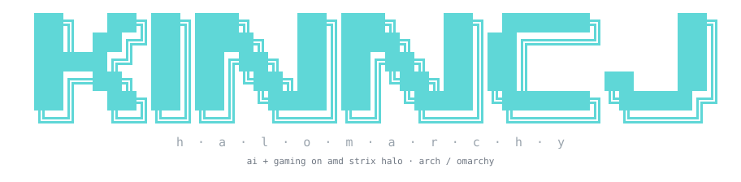

<p align="center">
  
</p>

<h1 align="center">halomarchy</h1>
<p align="center"><b>AI + gaming setup for AMD Strix Halo on Arch Linux / Omarchy</b><br>
<sub>Ryzen AI MAX+ 395 · Radeon 8060S · gfx1151 · HP ZBook Ultra G1a</sub></p>

<p align="center">
<a href="LICENSE"></a>
<a href="https://www.gnu.org/software/bash/"></a>
<a href="https://rocm.docs.amd.com/"></a>
<a href="docs/architecture.md"></a>
<a href="https://archlinux.org/"></a>
<a href="https://omarchy.org/"></a>
<a href="CONTRIBUTING.md"></a>
<a href="CODE_OF_CONDUCT.md"></a>
</p>

Reproducible, idempotent provisioning for an **AMD Ryzen AI MAX+ 395 "Strix Halo"**
laptop on **Arch Linux / Omarchy** — local LLM inference and fine-tuning on the
**Radeon 8060S iGPU (gfx1151)**, Vulkan gaming, the MIPI webcam, and host metrics.
One command, a real dry-run plan, and a documented reason for every workaround.

Built and verified on an **HP ZBook Ultra G1a** (Ryzen AI MAX+ PRO 395, 128 GB
unified memory) running Omarchy 4.0.0, kernel 7.1.8.

> **Before you start:** three BIOS settings must be right — Secure Boot off,
> TPM hidden, and Pluton disabled *for the install* then re-enabled so the
> laptop sleeps. See **[docs/bios.md](docs/bios.md)**.

```bash
git clone https://github.com/kinncj/halomarchy ~/.kinn_setup
cd ~/.kinn_setup
./install.sh --dry-run     # see exactly what would change
./install.sh --all         # apply
ai status                  # what's running
```

> **Why this exists:** several upstream guides are simply **wrong** for gfx1151.
> Unsloth's documented ROCm wheels contain no Strix Halo code at all, and
> `rocm-smi-lib` does not provide `amd-smi` on current Arch. Each fix is recorded
> in **[docs/decisions.md](docs/decisions.md)** with the failing symptom, so you
> can find it by pasting your error into a search box.

---

## What it sets up

| Module | What you get |
|---|---|
| `packages` | ROCm 7.2 HIP SDK, rocBLAS, MIOpen, RCCL, `amd-smi`, PyTorch, JDK, `uv` |
| `environment` | `/opt/rocm/bin` on PATH, AOTriton flash-attention flag, `rocminfo`/`hipcc` shims |
| `webcam` | AMD **ISP4** MIPI camera — DKMS below kernel 7.2, in-tree at 7.2+ |
| `gaming` | Mesa **RADV**, full 32-bit stack for **Proton**, GameMode, MangoHud, Steam |
| `playwright` | every Playwright Chromium renders WebGL on the **GPU** (ANGLE → Vulkan → RADV), not SwiftShader — machine-wide, survives `playwright install` |
| `power` | CPU clock cap that survives boot and resume, plus a held `balanced` profile — the ZBook powers off instantly under all-core boost bursts |
| `heimdall` | host metrics (CPU/GPU power, thermals) streamed to a hub |
| `ollama` | **Ollama** on ROCm, `:11434`, OpenAI-compatible |
| `lemonade` | **AMD Lemonade Server**, `:13305`, its own gfx1151 ROCm runtime — on-demand, not enabled at boot (`LEMOND_AUTOSTART=1` to change) |
| `unsloth` | LoRA fine-tuning venv, pinned to wheels that actually contain gfx1151, plus **Unsloth Studio** as an `ai`-managed service |
| `strix-llama` | `halo-box/strix-llama.cpp` with speculative prefill — **3.3x faster time-to-first-token** at 32k context; lossy, see `docs/services.md` |
| `commands` | the `ai` service-control command |

## Measured on this hardware

| Workload | Result |
|---|---|
| **Qwen3.8-27B** Q4 (Ollama, 100% GPU) | **18.3–18.6 tok/s** generation, 122 tok/s prefill |
| **Qwen3.8-27B** Q4 (Lemonade) | 17.5–17.6 tok/s (includes HTTP overhead) |
| 4-bit LoRA, Qwen3-0.6B | 5 steps in **1.5 s**, 0.71 GiB peak |
| GPU memory addressable | **54.9 GiB** GTT of 128 GB unified |

Generation on a dense 27B is **memory-bandwidth-bound** — no quant variant, MTP
build or attention flag moves it. Full numbers and dead ends (`nvfp4`, `mxfp8`,
`mlx`, the NPU) in **[docs/benchmarks.md](docs/benchmarks.md)**.

## Install

```bash
./install.sh                    # interactive, all modules
./install.sh --all              # non-interactive
./install.sh --target ollama    # one module, repeatable
./install.sh --dry-run          # plan only — writes nothing
./install.sh --uninstall        # tear down, reverse order
./install.sh --no-animation     # also honors NO_COLOR=1, TUI_NO_ANIM=1
./install.sh --quiet            # no logo
```

Machine-specific values (metrics hub address) live in an untracked `local.conf`:

```bash
cp local.conf.example local.conf   # then edit
```

It also holds the two path overrides: `KINN_VENV` (the Unsloth venv) and
`KINN_STUDIO_BIN` (Unsloth Studio's own CLI, which the `unsloth-studio` service
runs).

### The dry-run is a plan, not a log

Every verb compares declared state against reality — package **versions**, file
**content**, unit **enabled/active**, symlink **targets**:

```
╔══ plan ══════════════════════════════════════════════════╗
  +  to install                   0
  ~  to change                    5
  -  to remove                    0
  =  unchanged                    23
╚══════════════════════════════════════════════════════════╝
```

`+` new · `~` differs from repo · `=` already correct · `-` removed.
So it answers *"has this machine drifted?"* — and it does catch real drift.

## Running services

```bash
ai status                  # all services + loaded models
ai list                    # every target and unit, with live state
ai start ollama            # individual unit
ai start unsloth           # Unsloth Studio on :8888
ai restart heimdall        # a group
ai logs lemond             # follow journal
ai help                    # full reference
```

`ai help` and `ai list` are rendered from one registry in `bin/ai`, so they
describe *this* machine — units you never installed are marked, not hidden.

`lemond` and `unsloth-studio` are **user** services; `ollama` and `heimdall-*`
are **system** services. `ai` routes each to the right `systemctl` so you don't
have to remember which.

`unsloth` as a target means **Studio**, the server — the venv at `~/ai/unsloth`
is a library with nothing to start. Studio prints its URL and API key at
startup, so `ai logs unsloth` is where you find them.

Studio is **not** installed by this repo (it ships its own installer, and
nothing here pipes remote installers). Install it first, then `./install.sh
--target unsloth` wraps it in a user unit. See
[docs/services.md](docs/services.md).

## Tests

```bash
./tests/run.sh             # everything
./tests/run.sh dryrun      # matching tests only
```

Read-only and safe anywhere. Notably `dryrun_changes_nothing` checksums every
file the installer would touch and asserts the dry-run left them all untouched.

## Documentation

| | |
|---|---|
| [docs/bios.md](docs/bios.md) | **BIOS prerequisites** — Secure Boot, TPM, Pluton/s0i3 |
| [docs/architecture.md](docs/architecture.md) | hardware → drivers → runtimes → engines, memory layout |
| [docs/services.md](docs/services.md) | ports, user vs system scope, lifecycle |
| [docs/decisions.md](docs/decisions.md) | **why every pin and workaround exists** |
| [docs/benchmarks.md](docs/benchmarks.md) | measured numbers, and what does not help |
| [docs/troubleshooting.md](docs/troubleshooting.md) | error strings → causes → fixes |
| [docs/guidelines/](docs/guidelines/) | module contract, shell rules, docs style |

## Hardware & software this targets

**Hardware:** HP ZBook Ultra G1a · AMD Ryzen AI MAX+ PRO 395 · Strix Halo ·
Radeon 8060S iGPU · gfx1151 · RDNA 3.5 · XDNA NPU (RyzenAI-npu5) · 128 GB
unified LPDDR5X.

**Software:** Arch Linux · Omarchy · Linux 7.1.8 / 7.2 · ROCm 7.2.4 · amdgpu ·
amdxdna · Mesa RADV · PyTorch 2.12 · Triton · Unsloth · Ollama · AMD Lemonade ·
llama.cpp · bitsandbytes · DKMS · systemd · Steam/Proton.

Other Ryzen AI MAX machines (Framework Desktop, GMKtec EVO-X2, Beelink GTR9,
Minisforum MS-S1 MAX, ASUS ROG Flow Z13) share the same gfx1151 target — the
ROCm and inference modules should apply directly; only `webcam` is
ZBook-specific.

## Credits & vendors

This repo is mostly *glue*. The actual work belongs to:

| Project | Used for |
|---|---|
| [AMD ROCm](https://rocm.docs.amd.com/) | HIP, rocBLAS, MIOpen, RCCL, `amd-smi` |
| [AMD Lemonade](https://lemonade-server.ai/) | local model server with a gfx1151 runtime |
| [AMD ISP4 driver](https://git.kernel.org/pub/scm/linux/kernel/git/torvalds/linux.git/tree/drivers/media/platform/amd/isp4) | the MIPI webcam (fetched at install, GPL-2.0+) |
| [amdisp4-dkms](https://aur.archlinux.org/packages/amdisp4-dkms) | out-of-tree packaging below kernel 7.2 |
| [Unsloth](https://unsloth.ai/) | memory-efficient LoRA fine-tuning |
| [Ollama](https://ollama.com/) | model serving |
| [llama.cpp](https://github.com/ggml-org/llama.cpp) | the inference engine under both servers |
| [PyTorch](https://pytorch.org/) / [Triton](https://github.com/triton-lang/triton) | ROCm wheels and GPU kernels |
| [bitsandbytes](https://github.com/bitsandbytes-foundation/bitsandbytes) | 4-bit quantisation |
| [Mesa / RADV](https://www.mesa3d.org/) | Vulkan for gaming |
| [GameMode](https://github.com/FeralInteractive/gamemode) · [MangoHud](https://github.com/flightlessmango/MangoHud) | gaming tuning and overlay |
| [Arch Linux](https://archlinux.org/) · [Omarchy](https://omarchy.org/) | the base system |
| [Tailscale](https://tailscale.com/) | private network for metrics |
| [Heimdall](https://github.com/kinncj/Heimdall) | fleet metrics |
| [kinncj/statusline](https://github.com/kinncj/statusline) | the TUI this installer's look is built on |

Qwen models by [Qwen / Alibaba](https://qwen.ai/); Gemma by Google DeepMind.

## License

[MIT](LICENSE) — and the repository contains **no third-party source code**.

The AMD ISP4 webcam driver (GPL-2.0+) is fetched from the Linux kernel tree at
install time, at a pinned ref, and every file is checksum-verified before use.
See [PROVENANCE](files/webcam/isp4/PROVENANCE.md). Nothing else is vendored.

---

<sub>Keywords: Strix Halo Arch Linux · Ryzen AI MAX 395 Linux setup · gfx1151
ROCm · HP ZBook Ultra G1a Linux · Omarchy AI · Radeon 8060S ROCm · Ryzen AI Max
local LLM · Strix Halo Ollama · Strix Halo Unsloth · Lemonade Server Arch ·
amdisp4 webcam ZBook · Ryzen AI MAX gaming Proton · gfx1151 PyTorch.</sub>
