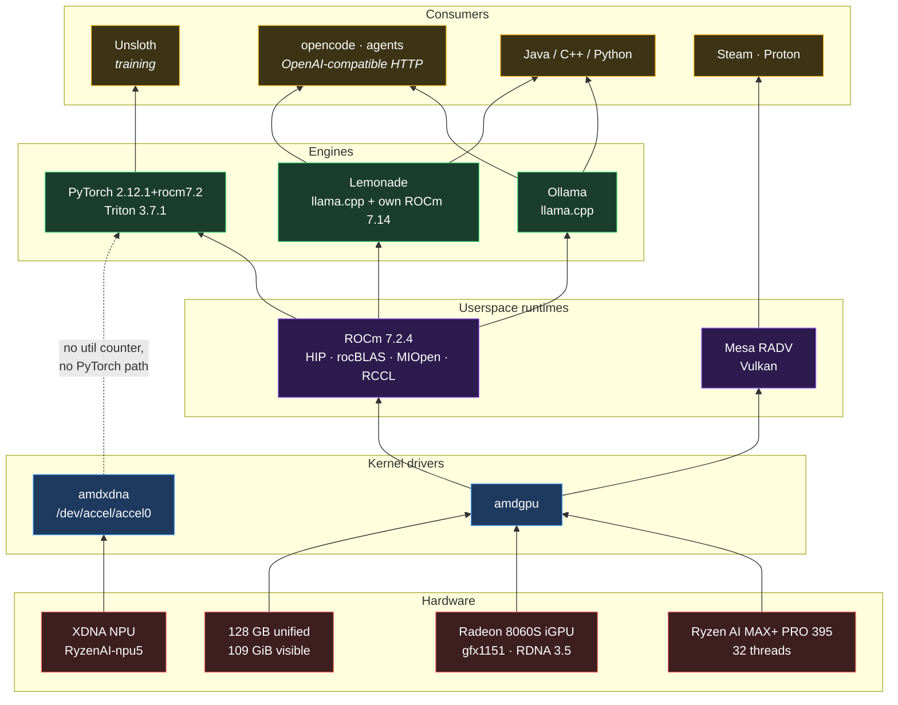
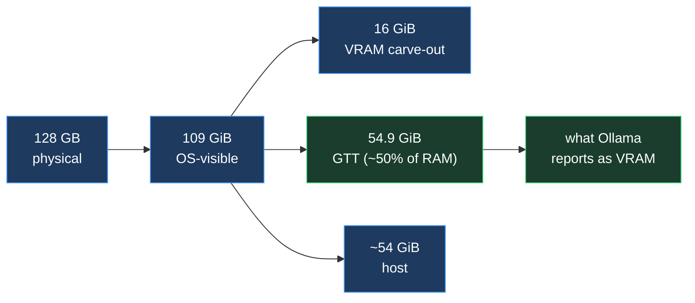

# Architecture

## The stack, bottom to top

The NPU is driver-present but a dead end: `amdxdna` exposes no utilisation
counter and there is no PyTorch path to it. ROCm enumerates it as an HSA agent;
nothing consumes it.

## Memory: the number that actually constrains you

`amdgpu` defaults GTT to ~50% of RAM. Raise it with `ttm.pages_limit` on the
kernel cmdline if a model needs more than ~55 GiB resident.

## Install flow

Ordering is load-bearing in two places: `environment` must precede
`unsloth` (bitsandbytes needs `rocminfo` on PATH), and `packages` must
precede everything (it installs `uv` and the ROCm toolchain).
