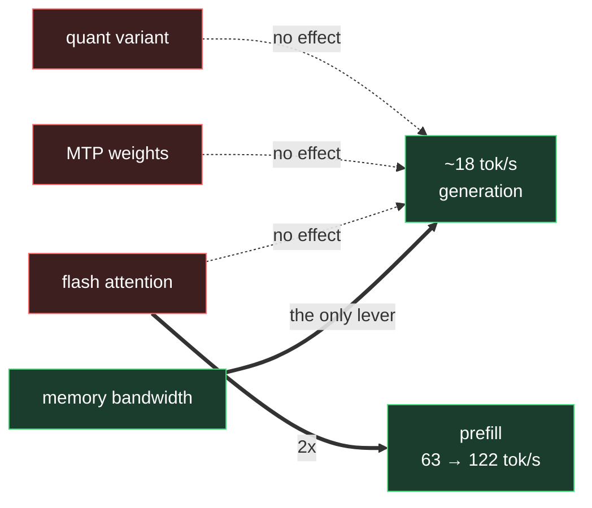

# Measured on this hardware

Ryzen AI MAX+ PRO 395 · Radeon 8060S (gfx1151) · 128 GB unified.

## Inference — Qwen3.8-27B, Q4, MTP weights

| Engine | Generation | Prefill | Notes |
|---|---|---|---|
| Ollama | **18.3–18.6 tok/s** | 63 → 122 tok/s warm | pure eval time, 100% GPU, 17 GB |
| Lemonade | **17.5–17.6 tok/s** | — | includes HTTP overhead |

Both are llama.cpp on ROCm, so they land in the same place.

**Generation is memory-bandwidth-bound.** A dense 27B at Q4 is ~17 GB and every
token re-reads the weights. No quantisation variant, MTP build or attention
flag moves it. Flash attention *does* roughly double prefill, which is
compute-bound — worth keeping for long prompts.

`qwen3.8:27b` and `qwen3.8:27b-mtp-q4_K_M` are the **same blob** in Ollama
(identical digest `22130167c4c2`). There is no faster tag to switch to.

## Training — 4-bit LoRA, Qwen3-0.6B

| | |
|---|---|
| 5 steps | 3.1 s → **1.5 s** with `TORCH_ROCM_AOTRITON_ENABLE_EXPERIMENTAL=1` |
| Loss | 5.1551 → 3.8377 (identical both ways) |
| Peak VRAM | 0.71 GiB |

That flag is set in `files/profile.d/rocm.sh`.

## Dead ends on RDNA 3.5

| Variant | Why not |
|---|---|
| `nvfp4` | NVIDIA Blackwell FP4 |
| `mxfp8` | needs FP8 hardware; RDNA 3.5 has none |
| `mlx`, `mlx-bf16` | Apple Silicon |
| `q8_0`, `bf16` | 2–4× the bytes, and you are bandwidth-bound |
| NPU (`amdxdna`) | no utilisation counter, no PyTorch path |
