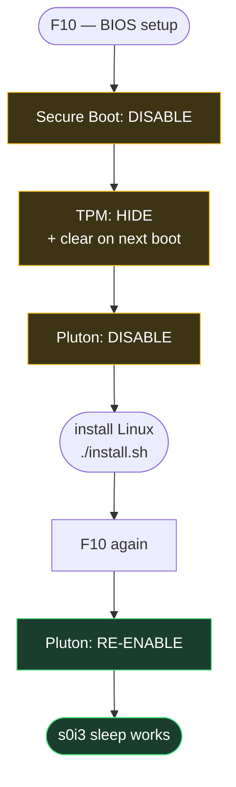

# BIOS / firmware prerequisites — HP ZBook Ultra G1a

Do this **before** running `./install.sh`. Three firmware settings decide
whether the install succeeds and whether the machine sleeps properly afterwards.

Verified on **HP ZBook Ultra G1a 14 inch Mobile Workstation PC**, BIOS
**X89 Ver. 01.04.05**. Enter setup with **F10** during POST (**Esc** for the
boot menu).



> **The one thing people get wrong:** Pluton is disabled *only for the
> installation* and must be **turned back on afterwards**, or the laptop will
> not enter `s0i3` modern standby — it will burn battery in suspend or fail to
> resume cleanly.

---

## 1. Secure Boot — disable

The DKMS webcam module is unsigned, and Secure Boot with module signing
enforced will refuse to load it. Out-of-tree kernel modules generally need
either Secure Boot off or your own MOK enrolment.

**Security → Secure Boot Configuration → Secure Boot: Disable**

Exact menu wording varies between BIOS revisions; the setting lives under
Security on this platform.

**Verify from Linux:**

```bash
bootctl status | grep -i "secure boot"
# Secure Boot: disabled (setup)
```

`disabled (setup)` means Secure Boot is off *and* the platform is in Setup
Mode — expected after clearing keys. Plain `disabled` is equally fine.

---

## 2. TPM — hide, and clear on next boot

**Security → TPM Device: Hidden**
**Security → Clear TPM on next boot: Enable** (one-shot; the firmware resets it)

Clearing removes stale ownership and sealed secrets left by a previous OS —
notably BitLocker or a prior Linux LUKS-TPM binding, which will otherwise fail
to unseal and can block boot.

**Verify from Linux:**

```bash
ls /dev/tpm*            # No such file or directory
ls /sys/class/tpm/      # empty
bootctl status | grep -i tpm2
# TPM2 Support: no
```

All three confirm the TPM is genuinely hidden from the OS, not merely disabled.

> If you later want TPM-backed LUKS unlocking, un-hide it *after* installation
> and re-enrol — but expect to redo the enrolment, since clearing invalidated
> anything previously sealed.

---

## 3. Pluton — disable for install, re-enable after

Microsoft Pluton is the on-die security processor on AMD Ryzen AI. On this
platform it is entangled with both the TPM path and the power-management path.

### Before installing

**Security → Pluton Security Processor: Disable**

Leaving it enabled during installation can present a TPM the installer tries to
bind to, and can interfere with clearing TPM state.

### After installing — turn it back on

**Security → Pluton Security Processor: Enable**

This step is **required for sleep**. With Pluton disabled, the platform does
not negotiate `s0i3` (modern standby / S0ix) correctly and suspend behaves
badly — high drain, or a resume that hangs.

**Verify from Linux:**

```bash
cat /sys/power/mem_sleep
# [s2idle]

cat /sys/power/state
# freeze mem disk
```

`s2idle` selected is the Linux side of `s0i3`. This machine reports
**`[s2idle]`** with no `deep` option, which is correct — Ryzen AI MAX platforms
implement modern standby, not S3.

Check it actually reaches the low-power substate after a suspend cycle:

```bash
sudo dmesg | grep -iE 'amd_pmc|s0i3|Last Suspend'
# amd_pmc: SMU idlemask: ...  /  suspend duration reported
```

If `amd_pmc` reports the platform never entered the deepest state, Pluton being
off is the first thing to check.

---

## Order of operations

| Stage | Secure Boot | TPM | Pluton |
|---|---|---|---|
| Before install | disabled | hidden + clear next boot | **disabled** |
| Installing | disabled | hidden | disabled |
| After install | disabled | hidden | **enabled** |

Secure Boot and TPM keep their install-time values. Only Pluton changes back.

---

## Related firmware notes

- **BIOS updates** can silently reset these. Re-check all three after any HP
  firmware update, especially Pluton.
- **`fwupd`** can update this machine's firmware from Linux
  (`fwupdmgr get-devices`, `fwupdmgr update`). Re-verify the settings after.
- The **webcam** needs the ISP4 driver; on kernels below 7.2 that means an
  unsigned DKMS module, which is the direct reason Secure Boot stays off. See
  [decisions.md](decisions.md) §12.
- Nothing in this repository changes firmware settings. `install.sh` will not
  touch your BIOS — these steps are manual, by design.
