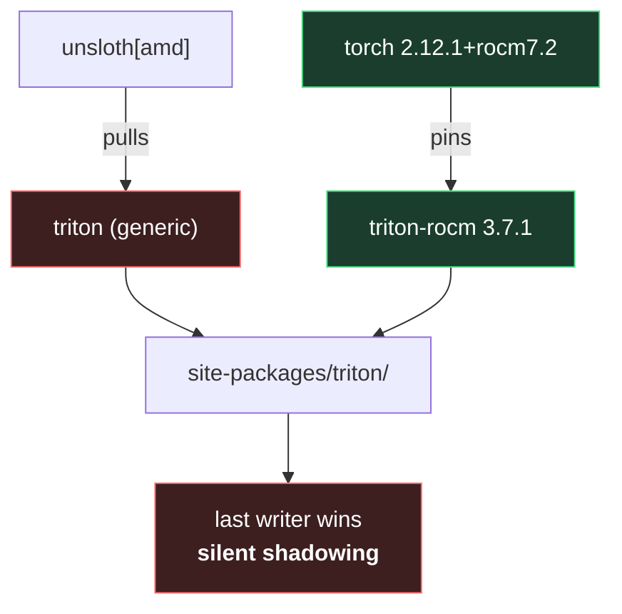
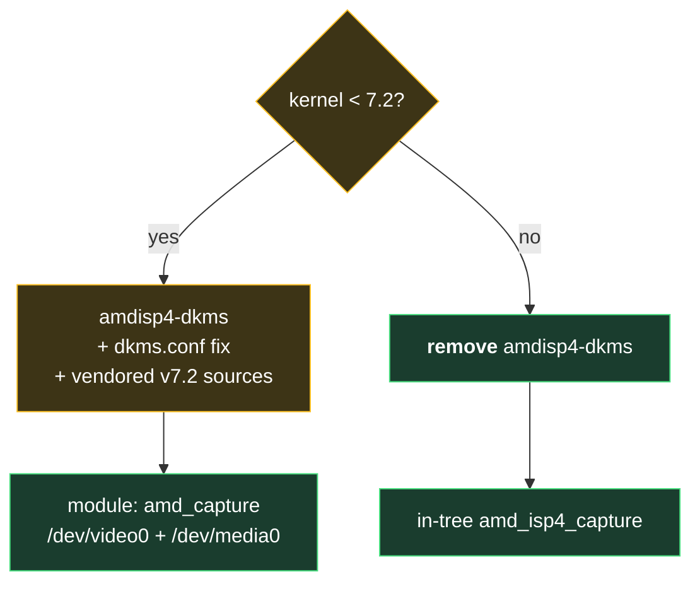

# Decisions

Why each pin and workaround exists. Every one of these was discovered by
something failing, not by reading docs — in three cases the docs were wrong.

## 1. torch from `rocm7.2`, not the documented `rocm6.4`

**Unsloth's install guide is broken on this GPU.** It says:

```sh
pip install torch==2.8.0 ... --index-url https://download.pytorch.org/whl/rocm6.4
```

That wheel contains no code for Strix Halo:

```
torch 2.8.0+rocm6.4   → gfx900 906 908 90a 942 1030 1100 1101 1102 1200 1201
                                                              ^^^^ jumps ^^^^
torch 2.12.1+rocm7.2  → ... 1102 1103 1200 1201 950 1150 gfx1151 ✓
```

Symptom: `HIP error: invalid device function` on a bare `torch.rand(device="cuda")`.
Unsloth genuinely supports gfx1151 — their *wheel pin* is what's stale.

## 2. torch **2.12.1**, not 2.13

`unsloth_zoo` declares `torch<2.13.0`. 2.13.0+rocm7.2 exists and works, but
installing it puts pip in a permanently unsatisfiable state.

## 3. `triton-rocm==3.7.1`, exactly one copy



Both distributions own `site-packages/triton/`. Whichever installs last wins,
and `pip list` still shows both — the version you get is not the version you
think. The fix is to uninstall both, `rm -rf` the directory, and reinstall only
`triton-rocm`.

The original failure was `cannot get address for 'hipDrvLaunchKernelEx' from
libamdhip64.so`: triton 3.7.1 needs a symbol the **rocm6.4** runtime lacks and
the **7.2** runtime has. Same version, opposite outcome, depending on which
torch it sits next to.

## 4. `bitsandbytes` from the continuous-release preview

Releases **≤ 0.49.2 have a 4-bit decode NaN bug on every AMD GPU.** The preview
wheel reports itself as `0.50.2.dev0`. Upstream is explicit that this step uses
`pip`, not `uv`.

## 5. No `xformers`, no `torchao`

Neither has a `rocm7.2` wheel, and the `rocm6.4` builds hard-pin torch 2.8.0 —
which brings back problem #1. torch SDPA is the fallback. Unsloth reports
`FA [Xformers = None. FA2 = False]` and trains fine.

## 6. `amdsmi`, not `rocm-smi-lib`

Several guides say `pacman -S rocm-smi-lib` "provides amd-smi". It does not —
it ships exactly one binary, `/opt/rocm/bin/rocm-smi`. The package is
**`amdsmi`**. Tools that shell out to `amd-smi` silently fall back or report
nothing until it exists.

## 7. `/usr/local/bin` shims for `rocminfo` and `hipcc`

`/etc/profile.d/rocm.sh` only runs for **login shells**. `bitsandbytes` shells
out to `rocminfo` at import, so anything started otherwise — a Jupyter kernel,
a user service, an IDE — reports "Could not detect ROCm GPU architecture".
Symlinking into a directory already on the default PATH fixes it everywhere.

Same class of bug hit systemd: units get `/usr/local/sbin:/usr/local/bin:/usr/bin`
and never read `profile.d`, so the Ollama drop-in sets `PATH` explicitly.

## 8. Scoped `--overwrite` for Lemonade

`lemonade-server` and `lemonade-desktop` both ship
`/usr/share/pixmaps/lemonade-app.svg`, neither declares `conflicts`, and both
live in `extra`. Diffing the two manifests shows that icon is the **only**
overlapping path out of 100+, so the overwrite is scoped to exactly that file.
This is an Arch packaging bug, not a local misconfiguration.

## 9. Heimdall helper/daemon split

`/sys/class/powercap/.../energy_uj` is `0400 root:root`, so `power.cpu` is
unreachable unprivileged. Rather than run the network-facing daemon as root,
a small read-only helper holds root and passes readings over a `0660` socket
gated by a shared `heimdall` group.

Without it `power.total` silently equals `power.gpu` — it reads plausibly and
is simply wrong.

## 10. `TORCH_ROCM_AOTRITON_ENABLE_EXPERIMENTAL=1`

Flash/mem-efficient attention on RDNA 3.5 is gated behind this flag. Measured
**2× faster** LoRA steps (3.1 s → 1.5 s for 5 steps) with an identical loss
curve. Off by default; set in `files/profile.d/rocm.sh`.

## 11. Ollama context length

Ollama sizes default context from available VRAM — with 54.9 GiB of GTT that
meant `num_ctx=262144` and **41 GB resident for a 4B model**. The drop-in pins
`OLLAMA_CONTEXT_LENGTH=8192`.

## 12. Webcam: vendored ISP4 sources, and a hard removal at 7.2

The ZBook's MIPI webcam needs the AMD ISP4 capture driver, which merged
upstream in **Linux 7.2**. Below that, the AUR `amdisp4-dkms` package is
required — but it does not build as shipped, for two independent reasons:

1. Its PKGBUILD substitutes `@_PKGBASE@` while `dkms.conf` contains
   `@_PKGNAME@`, so `PACKAGE_NAME` stays a literal placeholder and
   `dkms install` fails.
2. Its sources are the Nov-2025 patch revision, which still sets
   `vb2_ops.wait_prepare` / `wait_finish`. Both were removed from videobuf2
   before the driver merged, so it does not compile.

`files/webcam/isp4/` therefore vendors the sources **as merged in v7.2**,
verified to build on 7.1.8 (the only other API delta, `kmalloc_obj()`, already
exists there). The module restores them on every run, because any
`amdisp4-dkms` reinstall or update reverts to the broken originals.



**At 7.2 the DKMS package must be removed**, not merely left alone — it
shadows the in-tree module. The module does this automatically once
`uname -r` reports 7.2 or later, so the upgrade needs no memory on your part.

Note the out-of-tree module is named `amd_capture`, not the in-tree
`amd_isp4_capture`. Auto-exposure takes 1–2 s (~30–60 frames) to converge;
the first frames being near-black is normal, not a fault.

## 13. The unsloth *service* is Studio, not the venv

`ai start unsloth` has to start something, and the venv at `~/ai/unsloth` is a
library — importable, not runnable. Unsloth **Studio** is the daemon: it serves
the UI and an OpenAI-compatible API on `:8888` and supervises `llama-server`
children. So `files/systemd/user/unsloth-studio.service` wraps Studio, and
`ai`'s `unsloth` target is an alias for it.

Three things in that unit are deliberate:

- **`ExecStart` calls `~/.local/bin/unsloth`**, which belongs to Studio. The
  module still links the *venv* CLI as `unsloth-venv`; the two names must not
  be collapsed (see the Fixed entry in the changelog).
- **No `HSA_OVERRIDE_GFX_VERSION`.** gfx1151 is native in ROCm 7.2, and Studio
  clears an inherited override before launching `llama-server` anyway — setting
  one here would only contradict it.
- **`ExecStop` runs `unsloth studio stop`.** Studio tracks its `llama-server`
  children per `STUDIO_HOME`; letting it retire them is cleaner than leaving
  systemd to kill the cgroup out from under a loaded model.

The module does **not** install Studio. Studio ships its own installer, and
this repo does not pipe remote installers; when `~/.local/bin/unsloth` is
absent the module warns and installs no unit, rather than shipping one that
cannot start.

The unit is a **template**: `@STUDIO_BIN@` is substituted from
`KINN_STUDIO_BIN` (default `~/.local/bin/unsloth`) before installing, the same
way `heimdall-daemon.service` is rendered. Installing the raw template instead
would make the plan compare it against the substituted file on disk and report
`differs` forever.

The presence check is a **path**, not `command -v unsloth`. The venv ships a
binary of the same name, so a PATH lookup resolves to whichever comes first —
and inside an activated venv that is the wrong one. The name collision is
precisely why the hardcoded path is the safer check.

User units also needed their own `_lib.sh` verb. `unit_install` writes with
`sudo install`, which would prompt for a password to write a file under your
own `~/.config` — `user_unit_install` keeps `--target unsloth` password-free.

## 14. `ai` renders itself from one registry

`ai help` used to be a heredoc listing every unit, group and port by hand. Two
services in, that list was already a second source of truth waiting to drift:
nothing made it wrong to add a unit and never mention it.

So `status`, `list` and `help` are all rendered from the `USER_UNITS` /
`SYS_UNITS` / `DESC` / `ADDR` / `AI_GROUPS` tables at the top of `bin/ai`. A new
service is one row per table; there is no help text to update. `tests/run.sh`
asserts every registered unit appears in both `ai help` and `ai list`.

Two consequences worth knowing:

- **`ai list` marks missing units, it does not hide them.** A unit file that
  was never installed shows as `not installed` — an absent row would look
  identical to a service you forgot you had. `systemctl cat` is the probe,
  because it reads the unit file without needing root.
- **The group array is `AI_GROUPS`, not `GROUPS`.** `GROUPS` is bash's own
  read-only array of the caller's group IDs; assigning it fails with
  `cannot convert indexed to associative array`.

## 15. Playwright's Chromium is wrapped to run on the GPU

Headless Chromium falls back to **SwiftShader**: a software Vulkan device
that rasterises WebGL on the CPU. For a three.js scene that means every core
at 100 % for the length of the test run. On the ZBook Ultra G1a that exact
load pattern (a Playwright e2e suite, then a forced high-quality SwiftShader
render) preceded two instant power-offs on 2026-09-06/07 with 85 GB of RAM
free and nothing in the journal.

The fix is Dave Snider's GitHub-Actions recipe for Table Slayer
(<https://davesnider.com/gputests>): launch Chromium with

```
--ignore-gpu-blocklist --use-gl=angle --use-angle=vulkan
--enable-features=Vulkan --enable-gpu-rasterization --enable-zero-copy
```

and WebGL reports `ANGLE (AMD, Vulkan ... RADV STRIX_HALO)` instead of
`SwiftShader`. No xvfb is needed here: the headless shell binds the Vulkan
device without a display.

Why a **binary wrapper** and not a config: Playwright has no machine-wide
"extra args" hook. Flags belong in each project's `playwright.config.ts`, and
one forgotten project is one more CPU-only run. `playwright-gpu wrap`
renames every cached `chrome` and `chrome-headless-shell` under
`~/.cache/ms-playwright` to `<name>.real` and drops a POSIX-sh wrapper in its
place that prepends the flags and `exec`s the real binary. Details that
matter:

- **Chromium spawns children from `argv[0]`**, which after `exec` is the
  `.real` path, so the wrapper runs once per launch, never per renderer.
- **Chromium keeps the *last* occurrence of a switch.** The wrapper's flags go
  first, so a project's own `launchOptions.args` still win. The one exception
  is `--enable-features`, which Playwright already passes; the wrapper merges
  `Vulkan` into it instead of adding a second switch that would be dropped.
- **`playwright install` is not a package manager.** A new revision lands in a
  new directory with `INSTALLATION_COMPLETE` written last. The
  `playwright-gpu.path` user unit fires on the directory change and the
  service waits for that marker before wrapping; `Wants=` on the path unit
  also runs one wrap at login for installs that happened while it was off.
- `PLAYWRIGHT_GPU=0` in the environment bypasses the flags for one run, for
  comparing against SwiftShader on purpose.

Keep the flags in the project config too (MindCraft does): CI runners have
no wrapper, and a GPU runner benefits from the same switches.

## 16. CPU clock cap: the ZBook powers off under boost bursts

Twice in two days (2026-09-06 22:02, 2026-09-07 07:50) the ZBook Ultra G1a
went from running to *off* in an instant: no panic, no thermal message, the
journal simply stops and the next boot finds a dirty filesystem. Both times
the trigger was a burst of all-core CPU work (a Playwright suite, then a
forced high-quality SwiftShader render) with 85 GB of RAM free, both times
with power-profiles-daemon on `performance`.

Measured on 2026-09-07 with the same Playwright suite, now rendering on the
GPU (decision 15), so CPU load is moderate (load average 2–6):

| Profile | Boost | Peak Tctl | APU power at peak | Outcome |
|---|---|---|---|---|
| `performance` | on | **100.8 °C** in ~10 s | — | 4 of 6 "failures" were 45–60 s timeouts: the chip was throttling |
| `balanced` | on | **99.2 °C** | 37–52 W | timeouts gone, but still pinned at the thermal limit |
| `power-saver` | off (3.0 GHz) | **54.1 °C** | 26 W | comfortable (72 °C in an earlier run with another agent's build going on) |

The fans are audible and the die settles to 73–80 °C between bursts, so the
cooler works. What it cannot absorb is the transient: a Zen 5 core boosting
to 5.1 GHz is a hotspot that hits Tjmax (100 °C) within seconds, at a package
power the heatsink otherwise handles fine. Tctl is the hottest sensor, which
is why 40 W reads as 99 °C with boost on and 72 °C without it. The SMU
throttles at 100 °C and does not power the machine off, so whatever cuts the
power (the EC, or the USB-C source dropping its contract under a current
spike) is reacting to the same peak. Removing the peak removes both the
throttling and, on the evidence so far, the power cuts.

Note the "boost" column: on amd_pstate, power-profiles-daemon switches CPU
boost *off* in `power-saver` and back *on* in `balanced` and `performance`.
That is why `power-saver` was the only safe profile, and why picking
`performance` from the Omarchy menu quietly re-arms the problem. Until the
cap below is installed, `powerprofilesctl set power-saver` is the whole
no-root mitigation.

Hence a **clock cap**, not a profile. `kinn-cpu-cap` writes `scaling_max_freq`
on every policy; amd_pstate maps that to the highest allowed performance
level, so single-core hotspots cannot form. Details:

- **3000 MHz by default** — the nominal clock, i.e. what "boost off" means on
  this part, and the only configuration measured safe here. It costs peak
  single-thread speed and nothing else; raise `KINN_CPU_CAP_MHZ` in
  `local.conf` if you have headroom, the module rewrites `/etc/kinn/cpu-cap`.
- **A number in `/etc/kinn/cpu-cap`, not a flag in a script**, so the cap is
  a config change and the unit only runs when the file exists.
- **Re-applied after resume.** Suspend offlines the CPUs; when they come back
  cpufreq rebuilds each policy at the hardware maximum and the cap is gone
  without a trace. The `system-sleep` hook puts it back on `post`.
- **`After=power-profiles-daemon.service`** so the cap is written after the
  daemon has set its governor/EPP. The daemon never touches
  `scaling_max_freq` afterwards, so profile changes leave the cap alone.
- **The held profile is `balanced`**, not `power-saver`: with the cap in
  place the profile is about responsiveness, not safety. The daemon persists
  the last profile, so this survives reboots until someone picks
  `performance` from the Omarchy menu — which is fine, the cap still applies.

Not adopted, for now: `ryzenadj` (AUR 0.19.0, Strix Halo supported since
0.17) can cap package power and the throttle temperature directly
(`--tctl-temp`, `--stapm-limit`). It is the better knob if a clock cap
proves too blunt, but it needs raw PCI access and could not be verified
here. Also unverified: the charger. This firmware enumerates no USB-C ports
through UCSI, so the PD contract is invisible from Linux; confirm the HP
140 W adapter is the one plugged in.
