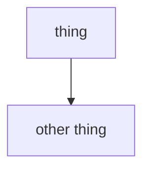

# Documentation style

## Diagrams are Mermaid

Every diagram in this repo is a Mermaid block — GitHub renders them natively,
they diff as text, and they need no toolchain.

````

````

Give nodes explicit quoted labels. Use `classDef` for colour so light and dark
themes both read:

```
classDef good fill:#1a3d2e,stroke:#4ade80,color:#fff
classDef bad  fill:#3d1f1f,stroke:#ff6b6b,color:#fff
```

Diagram the **mechanism**, not the file listing. A box-and-arrow of the
directory tree teaches nothing a `tree` command wouldn't.

## Write for someone with the error in their clipboard

`docs/troubleshooting.md` exists so a search engine can match the **exact**
error string. Quote errors verbatim in a fenced block, then explain the cause,
then the fix. Never paraphrase an error message — the literal text is the index
key.

## Record why, not what

`docs/decisions.md` is the point of this repository. Any pin, workaround or
non-obvious ordering gets an entry with:

1. the symptom (verbatim, if there is one)
2. the actual cause
3. what was done instead
4. what happens if someone "simplifies" it later

If a future reader could plausibly delete your line as redundant, say why they
shouldn't.

## Claims must be measured

Numbers in `docs/benchmarks.md` come from a run, with the method stated. Say
what was measured, not what should be true. If a result contradicts the
expected story, keep the result and change the story.
