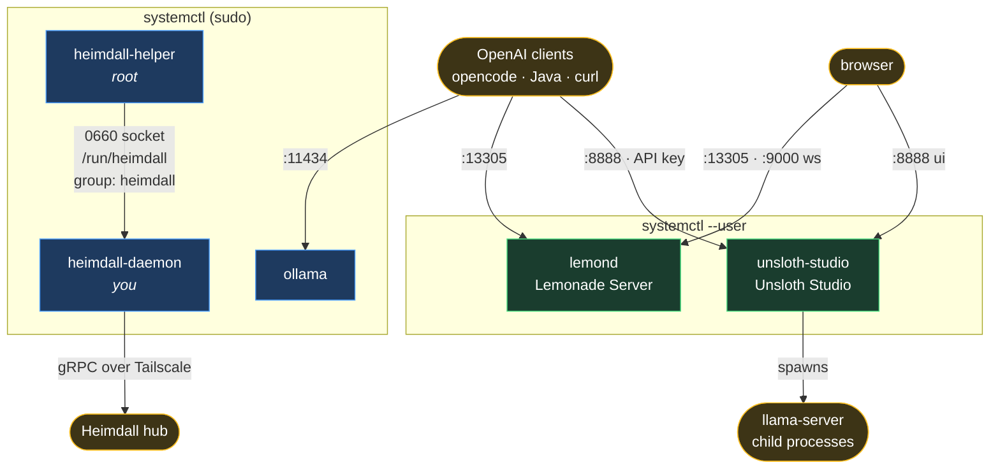
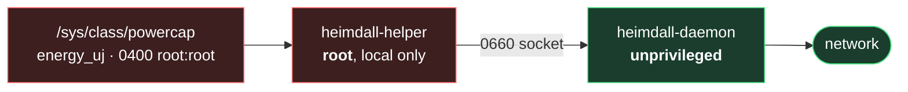

# Services



| Unit | Scope | Listens | Notes |
|---|---|---|---|
| `lemond` | **user** | `:13305` http, `:9000` ws | AMD-native; own ROCm 7.14 for gfx1151 |
| `unsloth-studio` | **user** | `:8888` ui + api | loopback only; supervises its own `llama-server` children |
| `ollama` | system | `:11434` | OpenAI-compatible at `/v1` |
| `heimdall-helper` | system (root) | unix socket | RAPL `power.cpu` + hwmon |
| `heimdall-daemon` | system (you) | — | streams to hub, auto-reconnects |

## Why the helper/daemon split



Only the small read-only helper holds root. The network-facing daemon stays
unprivileged; a shared `heimdall` group gates the socket.

## Control

```sh
ai status                  # all + loaded models
ai status ollama           # one unit
ai list                    # every target and unit, with live state
ai list groups             # just the group targets
ai list units              # just the units (marks any that are not installed)

ai start  ollama           # individual
ai stop   lemond
ai start  unsloth          # alias for unsloth-studio
ai restart heimdall        # group: helper + daemon
ai start  ai               # group: lemond + ollama + unsloth-studio
ai stop   all

ai enable all              # persist across reboots
ai disable ollama

ai logs lemond             # follow journal (routes user vs system)
```

`lemond` and `unsloth-studio` are **user** services; `ollama`/`heimdall-*` are
**system** services. `ai` picks the right `systemctl` so you never have to
remember which is which — that distinction is the single most forgettable thing
here.

## Unsloth: venv vs Studio

Two different things share the name, and only one of them is a service.

| | What it is | How you use it |
|---|---|---|
| `~/ai/unsloth` (the venv) | a **library** — torch/triton/bitsandbytes pinned for gfx1151 | `unsloth-venv`, or import it from a training script |
| `unsloth-studio` (the unit) | a **server** — the Studio UI + OpenAI-compatible API on `:8888` | `ai start unsloth` |

Studio installs itself under `~/.unsloth` and owns `~/.local/bin/unsloth`; this
repo only wraps that binary in a user unit. If Studio is not installed, the
`unsloth` module says so and installs no unit rather than shipping one that
cannot start — so `ai start unsloth` would answer:

```
Failed to start unsloth-studio.service: Unit unsloth-studio.service not found.
```

The fix is two steps, in order:

```sh
# 1. install Studio itself — see https://docs.unsloth.ai/
# 2. let this repo wrap it
./install.sh --target unsloth
ai start unsloth
```

If your Studio lives somewhere other than `~/.local/bin/unsloth`, point the
module at it in `local.conf`:

```sh
KINN_STUDIO_BIN="/path/to/unsloth"
```

The unit is a template — that path is substituted into `ExecStart`/`ExecStop`
at install time, so the plan keeps comparing like with like.

Studio prints its URL and a fresh API key when it starts, so:

```sh
ai logs unsloth            # URL + API key
```

The unit binds `127.0.0.1` and never passes `--cloudflare`/`--secure`, both of
which would publish this machine on a public internet URL.

## Adding a service

`bin/ai` renders `status`, `list` and `help` from one registry at the top of the
file. A new service is one row in each table plus its group membership:

```sh
USER_UNITS=(lemond unsloth-studio)          # or SYS_UNITS for a root unit
DESC[my-unit]="My Thing"
ADDR[my-unit]=":1234"
AI_GROUPS[ai]="lemond ollama unsloth-studio my-unit"
```

It then appears in `ai help`, `ai list` and `ai status` automatically, and
`ai <verb> my-unit` routes to the right `systemctl` scope. There is no second
place to update — `ai help` has no hardcoded list of units, and `tests/run.sh`
asserts every registered unit actually shows up in both `help` and `list`.

`ai list` marks anything whose unit file is missing as **not installed** rather
than hiding it, so a service you provisioned but never installed is visible
instead of silently absent.
