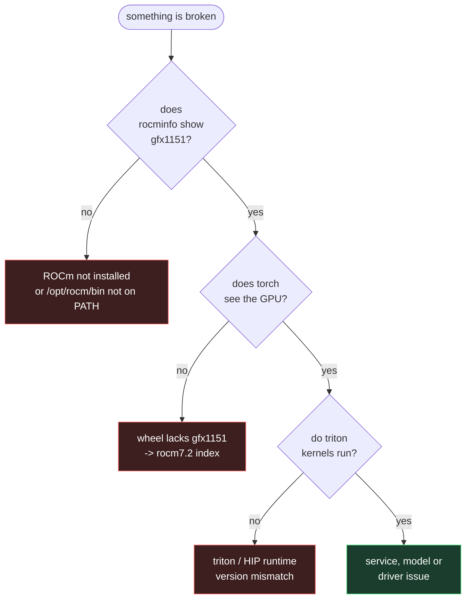

# Troubleshooting — AMD Strix Halo (gfx1151) on Arch / Omarchy

Exact error strings, their real causes, and the fix. If you arrived here from a
search engine with an error pasted in, look for it verbatim below.

Applies to: **Ryzen AI MAX+ 395 / 390 / PRO 395**, **Radeon 8060S / 8050S**,
**gfx1151**, RDNA 3.5, on Arch Linux, Omarchy, CachyOS, EndeavourOS.



---

## `HIP error: invalid device function`

```
torch.AcceleratorError: HIP error: invalid device function
HIP kernel errors might be asynchronously reported at some other API call...
```

Fires on something as simple as `torch.rand(8, device="cuda")`.

**Cause:** your PyTorch wheel contains no compiled code for gfx1151. Check:

```bash
python -c "import torch; print(torch.cuda.get_arch_list())"
```

If the list jumps `gfx1102 → gfx1200`, Strix Halo is missing. The
**`rocm6.4`** wheels do this — including the ones Unsloth's install guide
tells you to use.

**Fix:** install from the **`rocm7.2`** index.

```bash
pip install "torch==2.12.1+rocm7.2" --index-url https://download.pytorch.org/whl/rocm7.2
```

Use **2.12.1**, not 2.13 — `unsloth_zoo` requires `torch<2.13.0`.

---

## `cannot get address for 'hipDrvLaunchKernelEx' from libamdhip64.so`

**Cause:** Triton built for ROCm 7.x loaded against a ROCm **6.4** runtime.
The symbol does not exist in 6.4. Usually appears after `unsloth[amd]` pulls a
newer generic `triton` alongside a rocm6.4 torch.

**Fix:** align them — move torch to `rocm7.2` (above) and use the `triton-rocm`
version torch itself pins:

```bash
python -c "from importlib.metadata import requires; print([r for r in requires('torch') if 'triton' in r])"
```

---

## `Triton is not supported on current platform, roll back to CPU`

Often accompanied by:

```
[triton.runtime.build|WARNING] Triton cache error: compiled module hip_utils.so could not be loaded
```

**Cause:** two Triton distributions installed at once. `triton` and
`triton-rocm` (formerly `pytorch-triton-rocm`) both own
`site-packages/triton/`; whichever installed last wins, while `pip list` still
shows both. The version you get is not the version you think.

**Fix:** remove both, delete the directory, reinstall only the matched one.

```bash
pip uninstall -y triton pytorch-triton-rocm triton-rocm
rm -rf "$(python -c 'import site;print(site.getsitepackages()[0])')/triton"
pip install "triton-rocm==3.7.1" --index-url https://download.pytorch.org/whl/rocm7.2
```

The `_POSIX_C_SOURCE redefined` lines in that output are **warnings**, not the
cause — ignore them.

---

## `Could not detect ROCm GPU architecture` (bitsandbytes)

**Cause:** `bitsandbytes` shells out to `rocminfo` at import, and
`/opt/rocm/bin` is not on `PATH`. `/etc/profile.d/` only applies to **login
shells**, so Jupyter kernels, systemd user services and IDE terminals miss it.

**Fix:** put the binaries somewhere already on the default PATH.

```bash
sudo ln -sf /opt/rocm/bin/rocminfo /usr/local/bin/rocminfo
sudo ln -sf /opt/rocm/bin/hipcc    /usr/local/bin/hipcc
```

---

## `nvidia-smi: NVIDIA-SMI has failed` — on a machine with no NVIDIA GPU

Seen in monitoring tools reporting `gpu.util` / `gpu.vram` as unavailable.

**Cause:** the tool's GPU probe takes the NVIDIA path and never falls through
to AMD. The data is usually right there:

```bash
cat /sys/class/drm/card*/device/gpu_busy_percent
cat /sys/class/drm/card*/device/mem_info_vram_used
```

Note the card may be `card1`, not `card0`, and those nodes are world-readable
(`0444`) — no root needed. Report it upstream as a missing AMD fallback.

---

## `amd-smi: command not found` after installing `rocm-smi-lib`

**Cause:** `rocm-smi-lib` does **not** provide `amd-smi` on current Arch — it
ships only `/opt/rocm/bin/rocm-smi`, a different tool with different flags.
Several guides get this wrong.

**Fix:** `sudo pacman -S amdsmi`. Note it installs to `/opt/rocm/bin`, which is
not on systemd's `PATH` — services need it set explicitly.

---

## `error: failed to commit transaction (conflicting files)` — lemonade

```
lemonade-server: /usr/share/pixmaps/lemonade-app.svg exists in filesystem
(owned by lemonade-desktop)
```

**Cause:** an Arch packaging bug. `lemonade-server` and `lemonade-desktop` both
ship that icon and neither declares a conflict, despite both living in `extra`.

**Fix:** it is the only overlapping path between the two manifests, so a scoped
overwrite is safe:

```bash
sudo pacman -S --overwrite /usr/share/pixmaps/lemonade-app.svg lemonade-server
```

---

## Webcam: no `/dev/video0` on the HP ZBook Ultra G1a

The MIPI camera needs the AMD **ISP4** driver, which merged in **Linux 7.2**.

### `dkms install` fails with a literal `@_PKGNAME@`

**Cause:** the `amdisp4-dkms` PKGBUILD substitutes `@_PKGBASE@` while
`dkms.conf` contains `@_PKGNAME@`, so `PACKAGE_NAME` stays a placeholder.

```bash
sudo sed -i 's/@_PKGNAME@/amdisp4/' /usr/src/amdisp4-8/dkms.conf
```

### Compile fails on `wait_prepare` / `wait_finish`

**Cause:** the AUR sources are the Nov-2025 patch revision, which still sets
`vb2_ops.wait_prepare` / `wait_finish`. Both were removed from videobuf2 before
the driver merged.

**Fix:** replace `/usr/src/amdisp4-8/*.{c,h}` with the sources as merged in
v7.2 (`drivers/media/platform/amd/isp4/`). `installers/webcam.sh` does this
automatically, fetching and checksum-verifying them.

### Kernel 7.2 or newer

**Remove the DKMS package** — the out-of-tree module (`amd_capture`) shadows
the in-tree driver:

```bash
sudo pacman -R amdisp4-dkms
```

### First frames are black

Not a fault. Auto-exposure takes 1–2 s (~30–60 frames) to converge.

---

## `Unit unsloth-studio.service not found` — `ai start unsloth`

```
$ ai start unsloth
  start unsloth-studio
Failed to start unsloth-studio.service: Unit unsloth-studio.service not found.
```

**Cause:** the unit was never installed. The `unsloth` module installs it only
when Unsloth **Studio** is present, because the unit runs Studio's own CLI
(`~/.local/bin/unsloth`). Studio ships its own installer and this repo does not
pipe remote installers, so a machine without Studio gets no unit rather than a
unit that cannot start.

**Fix:** install Studio (<https://docs.unsloth.ai/>), then let the module wrap
it:

```bash
./install.sh --target unsloth      # installs + enables unsloth-studio.service
ai list units                      # confirms it is no longer "not installed"
ai start unsloth
```

Studio somewhere else? Point `local.conf` at it — the unit is a template and
the path is substituted in:

```bash
KINN_STUDIO_BIN="/path/to/unsloth"
```

**Note the venv is not the service.** `~/ai/unsloth` is a library — importable,
not runnable. `ai start unsloth` means Studio, always.

---

## Only ~55 GiB of GPU memory on a 128 GB machine

**Not a bug.** `amdgpu` defaults GTT to roughly half of system RAM, so a 128 GB
machine reports ~54.9 GiB addressable. The separate 16 GiB figure is the
firmware VRAM carve-out.

Raise it with `ttm.pages_limit` on the kernel command line if a model needs
more resident. On Strix Halo, `mem_info_vram_*` reflects the GTT/VRAM carve-out,
**not** system RAM.

---

## Inference feels slow (~18 tok/s on a 27B)

That is the hardware ceiling, not a misconfiguration. Generation on a dense
27B at Q4 is **memory-bandwidth-bound**: every token re-reads ~17 GB of
weights. Quantisation variant, MTP weights and flash attention do not change it.

Flash attention **does** roughly double *prefill* (60 → 122 tok/s), so it is
still worth enabling for long prompts.

Things that will **not** help on RDNA 3.5: `nvfp4` (NVIDIA Blackwell),
`mxfp8` (needs FP8 hardware), `mlx` (Apple Silicon).

---

## The NPU shows up but nothing uses it

`rocminfo` lists `RyzenAI-npu5` and `/dev/accel/accel0` exists, but the
`amdxdna` driver exposes **no utilisation counter** and there is no PyTorch
path to it. Monitoring tools correctly report `npu.util` as unavailable. On
Linux today, the practical NPU route is Lemonade's `flm:npu` backend.

---

Still stuck? Open an issue with `uname -r`, `rocminfo | grep gfx`,
`./install.sh --dry-run --all`, and the exact error text.

## Playwright tests pin every CPU core (WebGL says `SwiftShader`)

Headless Chromium renders WebGL in software unless told to use the GPU. Check
what a test actually gets:

```js
const gl = document.createElement('canvas').getContext('webgl2');
gl.getParameter(gl.getExtension('WEBGL_debug_renderer_info').UNMASKED_RENDERER_WEBGL);
// want: ANGLE (AMD, Vulkan ... RADV STRIX_HALO ...), radv
// bad:  ANGLE (Google, Vulkan ... SwiftShader Device ...)
```

`./install.sh --target playwright` wraps the cached browsers so they launch
with the ANGLE/Vulkan flags. `playwright-gpu status` shows which binaries are
wrapped; after a `playwright install` of a new revision the `playwright-gpu.path`
user unit wraps it within seconds, or run `playwright-gpu wrap` yourself.
See `docs/decisions.md` §15.

## The laptop switches off instantly under load (no panic, journal just stops)

Not memory and not a crash: a Zen 5 core boosting to 5 GHz hits 100 °C within
seconds, and something on the ZBook Ultra G1a cuts power at that peak. Check
whether you are running uncapped:

```sh
kinn-cpu-cap status     # want: cap=3000 MHz ... profile=balanced
sensors | grep Tctl     # anything near 100 °C under a light load is the hotspot
```

`./install.sh --target power` installs the cap and re-applies it after every
resume. Raise `KINN_CPU_CAP_MHZ` in `local.conf` only with the sensors open.
If it still happens with the cap in place, verify the charger is the HP 140 W
unit; a weaker USB-C source can drop its contract under a current spike, and
this firmware does not expose the PD contract to Linux. Background in
`docs/decisions.md` §16.
